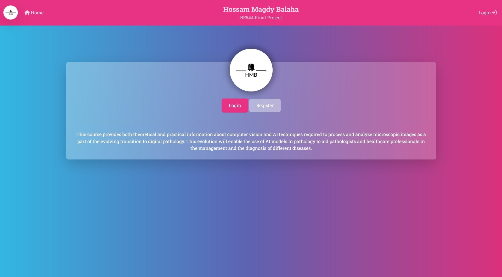

# BE544 AI Techniques in Pathology (Final Course Project Fall 2022)

By: **Hossam M. Balaha**
<br>
C.V.: https://hossambalaha.github.io/

## Overview

In short words, the project handles the classification, augmentation, and segmentation tasks using deep learning and
digital image processing.
A web interface is implemented to facilitate the user interaction.
The website is fully dynamic, so each user has an individual dashboard.

## Promo Video

A promo video can be found here: https://youtu.be/vuN_Z-4aokc

The interface design is shown in the following figure:



## Used Languages

### Backend

- Python (https://www.python.org/).
    - Flask (https://flask.palletsprojects.com/en/2.2.x/).
    - OpenCV (https://opencv.org/).
    - Numpy (https://numpy.org/).
    - Pandas (https://pandas.pydata.org/).
    - Scikit-learn (https://scikit-learn.org/stable/).
    - Matplotlib (https://matplotlib.org/).
    - Tensorflow GPU (https://www.tensorflow.org/).
    - Keras (https://keras.io/).
    - flask_wtf (https://flask-wtf.readthedocs.io/en/1.0.x/).
    - flask_session (https://flask-session.readthedocs.io/en/latest/).
    - werkzeug (https://werkzeug.palletsprojects.com/en/2.2.x/).
    - mysql-connector (https://dev.mysql.com/doc/connector-python/en/).
- MySQL from XAMPP (https://www.apachefriends.org/).

### Frontend (Web Interface)

- JavaScript (https://www.javascript.com/).
- HTML (https://html.com/).
- CSS (https://www.w3schools.com/css/).
- Bootstrap 5 Framework (https://getbootstrap.com/).
- jQuery Library (https://jquery.com/).
- OpenSeadragon Library (https://openseadragon.github.io/).
- Font Awesome Library (https://fontawesome.com/).
- DataTables Library (https://datatables.net/).
- ViewerJS Library (https://fengyuanchen.github.io/viewerjs).
- SweetAlert2 Library (https://sweetalert2.github.io/).
- Bootstrap Theme from https://bootswatch.com/quartz/

## Installation

### Requirements

You can install the required packages using the following command:

```
pip install -r requirements.txt
```

### System Environment

You need to install QuPath (https://qupath.github.io/) and add it to the system path.
You need to define the system environment variable `PAQUO_QUPATH_DIR` as the variable name
and the QuPath installation directory as the variable value.

You need to install OpenSlide (https://openslide.org/) and add it to the system path.

### Database

You can create a database named `be544` and use the `be544.sql` SQL file to create the required tables.

The database design is shown in the following figure:


### Run

You can run the application in the debug mode using the following command:

```
flask --app main --debug run
```

You can run the application in the production mode using the following command:

```
flask --app main run
```

## Project Repo. on GitHub

**Link**: https://github.com/HossamBalaha/BE544-Final-Course-Project-Fall-2022

## Copyright

All rights reserved. No part of this publication may be reproduced, distributed or
transmitted in any form or by any means, including photocopying, recording or other
electronic or mechanical methods, without the prior written permission of me, except in
the case of brief quotations embodied in critical reviews and certain other non-
commercial uses permitted by copyright law. For permission requests, write to the
publisher at the address below.
Email: `h3ossam@gmail.com`